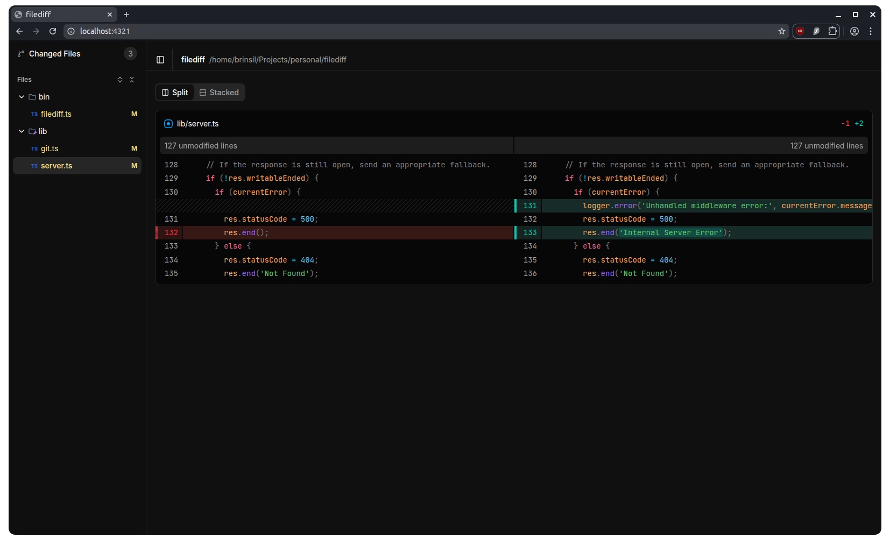

# filediff

A browser-based git diff viewer. Run it in any git repo and it opens a clean, visual diff of your changes in the browser.

## Why

I wanted to view the diffs of a local folder and be able to screen share it in a better way. The diffing view in the editor was not enough, so I built a CLI that serves a proper diff view in the browser.



## Features

- Syntax highlighted diffs
- Side-by-side (split) and stacked (unified) diff views
- Filter to a subdirectory within the repo
- Uses execFile instead of exec to prevent shell injection
- Spins up a simple Node HTTP server with no external dependencies

## Installation

```
npm install -g @brinzl/filediff
```

## Usage

```
filediff [options]

Options:
  -d, --dir <path>       Directory to serve (default: .)
  -p, --port <number>    Port number (default: 4321)
  -s, --sub-dir <path>   Filter to a subdirectory within the repo
  -o, --open             Auto-open the browser
  -h, --help             Show this help message
```

## Acknowledgments

Some libraries and tools that made it much simpler to build the UI.

- [@pierre/diffs](https://diffs.com) for the diff rendering component that powers the diff view
- [shadcn/ui](https://ui.shadcn.com) for the UI components that made building the interface a lot easier
